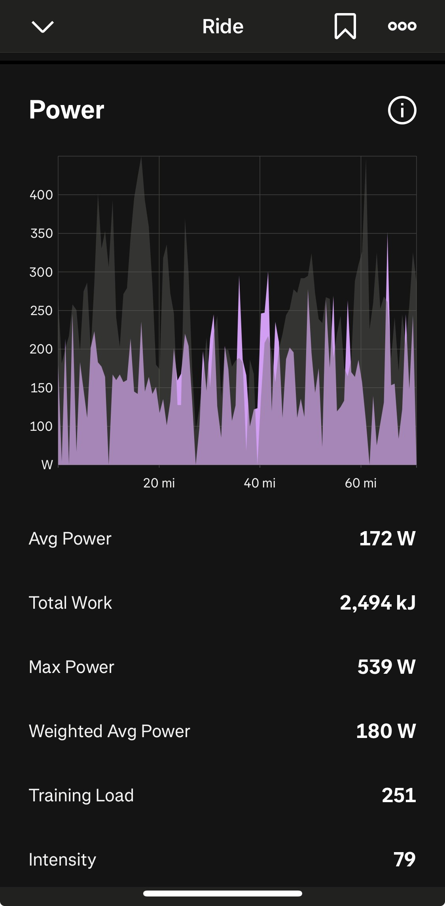

# Module 12 Individual Assignment — Critique an Information Visualization

**Course:** SWE 632 — User Interface Design 
**Author:** Laws Smith 
**Due:** April 13, 2026

## Visualization Critiqued

Source: Strava mobile app, the Power chart on a single ride.

I picked this one because I ride a lot and this is the chart I scroll to first after pretty much every ride. It's the one that tells me how a ride actually went, not just how it felt.

## 1. Data and Data Types

Three things are being shown, and they're all quantitative.

Power in watts is on the y-axis, scaled from 0 to a bit over 400. That's what I'm putting through the pedals at any given second. Distance in miles is on the x-axis, with ticks at 0, 20, 40, and 60. And the gray silhouette behind everything is the elevation profile. Elevation is quantitative too, but Strava doesn't give it a y-axis here, so you really only get the shape of the ride and not the actual numbers.

There's also a stats panel below the chart with Avg Power, Total Work, Max Power, Weighted Avg Power, Training Load, and Intensity. Those aren't really part of the chart, but they sit right under it and you end up reading them together.

## 2. Visual Variables Used to Encode the Data

The chart uses a 2D orthogonal spatial substrate with two quantitative axes. Position on the x-axis encodes distance and position on the y-axis encodes power, so position is the primary encoding for both of the variables that have a y-scale. The marks are 2D areas — one filled area under the power curve, one filled area under the elevation silhouette. Color distinguishes the two series (purple for power, gray for elevation), and the gray is deliberately low saturation so it reads as background. The two area marks are layered in the same coordinate space rather than split into small multiples.

A few graphical properties from the module's taxonomy aren't used here. Size of individual marks isn't varied, orientation isn't varied, texture isn't varied, and shape isn't varied. Grayscale isn't really used either, beyond the choice to desaturate elevation. That's a fair choice for this kind of time-series chart, since position already carries the main quantitative information and adding extra variables could muddy the comparison.

## 3. Critique of the Visual Variable Choices

Position for power and distance is the obvious right call. Power is a function of distance (or time, which would look basically the same), so mapping them to x and y is the most accurate way to read the values.

Purple works well for power. In any cycling app, red is basically taken by heart rate, and green or blue usually mean speed or pace. Purple doesn't really carry other connotations in this world, so it just becomes "the power color" and doesn't clash with anything.

Gray for elevation is the right choice because elevation is supporting context, not the point of the chart. The chart is about power. If elevation were a saturated color, it would fight for attention and mess up the hierarchy.

Filling in the power curve is my favorite thing about this chart. Two reasons. The area under power over time is literally the work you did on the bike, so the amount of purple on the screen actually matches how I'd describe a ride ("that one was a lot of work"). The second reason is that power is really spiky. It bounces between 100 and 400 watts in seconds. If they drew it as a thin line, the chart would be a wall of vertical scribbles and you couldn't follow it. Filling it in lets your eye track the envelope of effort instead of chasing every wiggle.

Leaving the elevation without a y-axis is a fair trade. You could argue for putting a second axis on the right for elevation values, but that's not what this chart is for. If I want exact climb numbers there's a separate elevation chart. This view is just here to tell me where on the ride I was working hard and whether the hills explain it. Adding another axis would clutter it for not much gain.

Layering power on top of elevation in a single chart instead of stacking two charts is the right call for the same reason. The comparison is instant. Two stacked charts would force your eye to bounce back and forth trying to line up the same mile marker on both.

A few things are less effective. The purple on the dark gray background doesn't have great contrast, especially in bright outdoor light on a phone screen, which is exactly when a lot of people are looking at this chart right after a ride. A brighter or more saturated color would be easier to read. There are also no gridlines in the plot area, only tick labels at the edges. That means if I want to eyeball whether a spike is 250W or 300W, I have to mentally project from the edge labels across the whole chart, and the spiky shape makes that even harder. Light horizontal gridlines at every 100W would help a lot. And there's no zoom or scrub interaction on this view. On a 60-mile ride compressed into a few inches of screen, individual seconds get squashed into sub-pixel widths, so even if I want to get precise numbers out of the chart I can't really pull them out without going somewhere else.

## 4. Critique of the Overall Design

The easy stuff first. Did I work hard on the climbs and ease off on the descents? This is the question the chart is built to answer, and you get the answer in a second. Where were the hardest efforts? The tallest spikes jump out. Roughly how much work did I do? The amount of purple on the screen tracks with how the ride actually felt. How did I pace it? You can tell whether I went out hot, faded, or stayed even.

The hard stuff. Reading exact numbers is almost impossible. The spikes are one pixel wide, so you can tell that you spiked but not what the wattage actually was at, say, mile 23, without scrubbing or hovering. Elevation values aren't readable either because there's no scale. Slow trends across the ride, like fading in the second half, don't really show up because the signal is so noisy. And you can't compare this ride to any other ride, there's no overlay or benchmark of any kind.

So what's this chart good for? Looking at a ride right after I finish it and figuring out how I paced it. Seeing which climbs cost me. Confirming that my effort lined up with the terrain.

What isn't it good for? Detailed lap or segment analysis, since there aren't any lap markers in this view. Tracking progress over multiple rides. Pulling exact numbers. Real-time use during a ride (this is a post-ride view).

Some things I'd add. An average power line or a normalized power line drawn over the spikes would make pacing trends readable instead of something you have to imagine through the noise. Lap or segment markers as vertical lines would let me tie efforts to parts of the ride that actually mean something, like a known climb or a sprint segment. Overlaying speed as a third series would help too, since power, terrain, and speed are really the trio that explains a ride. Power zone shading on the y-axis in faint horizontal bands would give an instant read on how hard each spike actually was for me, not just in raw watts. And a toggle between distance and time on the x-axis would help, because those tell different stories on hilly rides.

One thing worth saying: the stats panel underneath the chart (Avg Power, Max, Weighted Avg, Total Work, etc.) quietly backfills a lot of what the chart can't show precisely. I think that's a smart pairing. The chart gives you the shape and the feel of the ride, the numbers underneath give you the precision.
