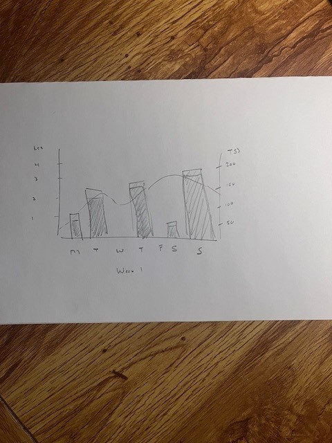
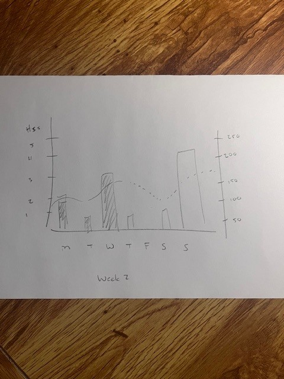
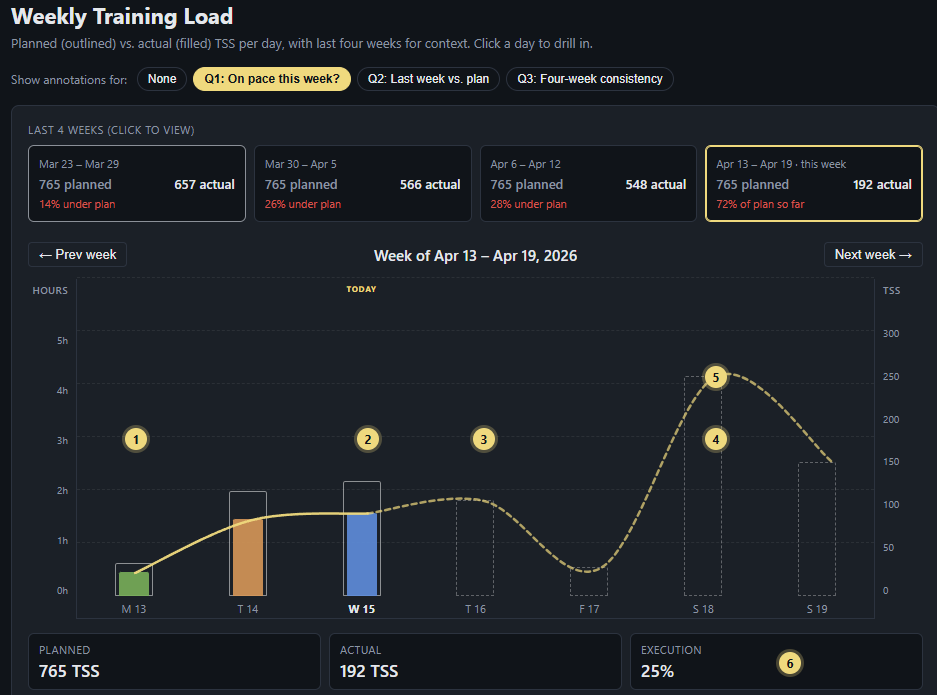
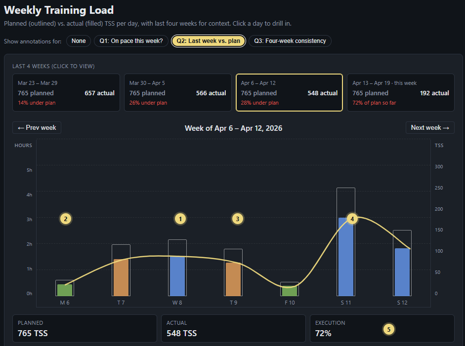
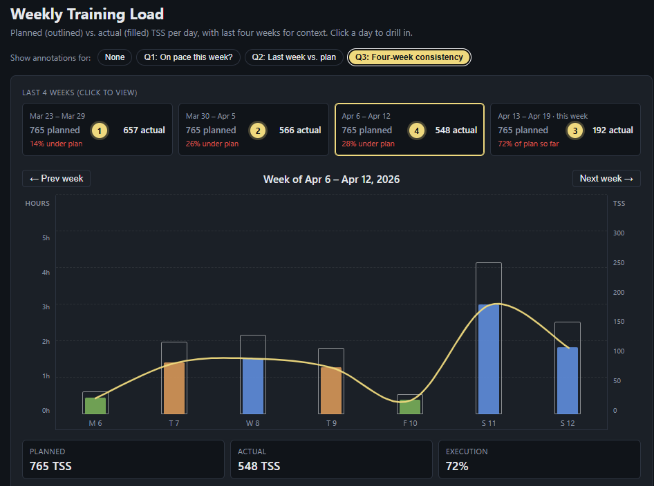

# Module 13 Individual Assignment — Design an Information Visualization

**Course:** SWE 632 — User Interface Design
**Author:** Laws Smith
**Due:** April 20, 2026

### Overview

Quick context first. Cyclists measure training in Training Stress Score (TSS). An easy hour is about 60 TSS, an hour of hard intervals is around 100, a long weekend ride is 200-plus. Coaches write plans in TSS, every training app tracks it, and it's the shared number everyone uses. A 700 TSS week means something specific. So does missing half of one.

I picked this because I ride a lot and I spend a stupid amount of time each week asking the same question: am I on track, or am I kidding myself? The stakes aren't abstract. Fitness comes from repeated, sustainable stress. Miss too much and you lose ground. Pile on too much and you dig a hole that takes weeks to climb out of. So "am I on pace" isn't vanity — it's the input that tells me whether to squeeze in Thursday's intervals, cut Saturday short, or let the week go. The tools I use (TrainingPeaks, Strava, Garmin) are great at long-term trends, but the mid-week question — what's planned, what's done, what's left — is weirdly hard to answer in any of them. You bounce between a calendar and a fitness chart and do the subtraction in your head. I wanted one view that put planned and actual side by side, day by day.

I started on paper to lock in the core encoding: planned TSS as an outlined bar, actual TSS as a filled bar inside it. From there I had Claude expand the sketches into the interactive prototype in `mockup.html` — single-week view, four-week summary strip above it, day detail panel on the side.

   
  <em>Week 1 sketch — retrospective week, every day has both planned outline and actual fill.</em>

   
  <em>Week 2 sketch — mid-week, past days filled, future days outlined only, dashed projection curve.</em>

### The Fictional Dataset

Four weeks of simulated daily training. Each day has a date, a planned TSS, an actual TSS (if the session was completed), the ride type, duration, and a short note. Ride types: endurance, intervals, race, recovery. The viz computes each week's planned total, actual total, and execution percentage, and flags the current day as TODAY so past, present, and future all read differently. In a real app the planned values come from a coach-set plan; here they're generated from a weekly template so the demo stands alone.

### Questions the User Wants to Answer

**Q1: Am I on pace to hit this week's plan?**
This is what I ask myself every Wednesday night. Which days are done, which are still ahead, and did Monday and Tuesday track well enough that Saturday's long ride is still realistic? Every session is either fitness I gain or fatigue I still have to work off, and the rest of the week absorbs whatever happened. Catching drift on Wednesday lets me move Thursday or cut Saturday. Catching it Saturday morning doesn't help.

**Q2: How closely did I execute last week, and where did I deviate?**
Where did I hit the number, where did I come up short, where did I go over? Training only works if you actually do it. What kills progress isn't one missed session — it's a quiet drift of undershooting the same day every week. If Tuesday keeps sliding, the plan needs to change, or Tuesday does.

**Q3: Am I consistent week to week, or chasing and crashing?**
Zoom out four weeks. Fitness comes from repeated, sustainable weeks. 85-95% execution four weeks in a row beats 120% / 60% / 120% / 60%. The pattern is invisible inside any single week, so I need a way to see it at a glance. This is what separates real progress from training-hard-in-spurts.

### Design of the Visualization

**Starting from sketches.** I worked the idea out on paper before writing code. The two sketches at the top show the same chart in two states. Week 1: completed week, every bar has both the outline (planned) and the fill (actual). Week 2: mid-week, first three days filled, rest outlined only, dashed curve projecting the remaining days. Locking the dual encoding on paper kept the code version honest. Claude handled the implementation; the design came from the sketches.

**Visual encodings.** Time on x, TSS on y — Module 12 calls position the best encoding for quantitative data. The dual encoding per day is the part I care about most: outline = planned, fill = actual, so the comparison is a single mark instead of two numbers to subtract. Ride type uses color hue (the right channel for nominal data). Future days get a dashed outline instead of solid, which distinguishes past / today / future without a new color. A yellow trend curve runs through the top of each bar (solid through past, dashed through future) so the shape of the week reads as one line. Two y-axes — hours left, TSS right — because cyclists think in both.

**Multiple views.** Three views. The four-week strip at the top summarizes each week as planned total, actual total, and a delta label — that's where Q3 gets answered. The main week view shows seven days of planned-vs-actual bars — that's where Q1 and Q2 get answered. The day detail panel populates when you click a day. Clicking any card in the four-week strip loads that week into the main chart — overview to detail.

**Interactions (Shneiderman's mantra).** Overview: four-week strip. Zoom: click a card or use the week arrows. Details on demand: click a day for the session panel. The annotation toggle (None / Q1 / Q2 / Q3) is a teaching aid — it doesn't change the interaction model, it just overlays numbered callouts on top.

### How the Interactions Answer the Questions

**Q1: Am I on pace to hit this week's plan?**
The viz snaps to the current week. Mon and Tue show both planned outline and actual fill. Wednesday is marked TODAY. Thu through Sun show outlines only. Saturday's outline is the tall one — that's the long ride. The Execution tile reads the running percent for the part of the week that's done.

   
  <em>Q1: current week, mid-week state, numbered callouts on the six elements below.</em>

1. Mon and Tue are done. Outline and fill both visible, so each day reads as "here's what was prescribed, here's what I did."
2. Wed is today. The TODAY marker and bolded day label call it out; only the part of the day already ridden shows as fill.
3. Thu-Sun are future. Dashed outlines mean planned but not started; no fill because nothing's happened yet.
4. Saturday's tall outline is the long ride. Seeing it sitting at the end of the week shapes how I pace Thu and Fri.
5. Trend curve — solid through past, dashed through future — so the shape of the week reads as one line.
6. Execution tile: percent of planned TSS actually logged so far, updated as days finish.

**Q2: How closely did I execute last week, and where did I deviate?**
Click Q2 and the chart jumps to the previous week. Every day has both outline and fill now. Fill matches outline = on plan. Fill shorter than outline = undershot. Fill past outline = went over.

   
  <em>Q2: previous week, fully completed, five callouts on the deviation patterns.</em>

1. Fill reaches the top of the outline = day went to plan. Nothing to investigate.
2. Fill stops short of the outline = came up short. Gap length = size of the miss.
3. Fill past the outline = went over plan. Sometimes good (felt great), sometimes a warning (hammering a recovery day).
4. Trend curve traces the actual shape of the week — whether the hardest day landed where the plan expected it or somewhere else.
5. Execution tile sums the week in one number. Gut check before going day by day.

**Q3: Am I consistent week to week, or chasing and crashing?**
The four-week strip is the overview. Each card shows planned total, actual total, and a delta label (on / under / over), color-coded so consistency reads at a glance. The current week card updates as days finish. Click a card to load that week into the chart.

   
  <em>Q3: four-week strip, four callouts on the overview-to-detail behavior.</em>

1. Each card: planned total, actual total, delta label. Three numbers per week.
2. Color coding makes consistency the thing that jumps out. Four green "on plan" in a row is the goal. A red "30% under" next to a green "on plan" is the thing to avoid.
3. Rightmost card is always the current week. Sitting next to three completed weeks gives immediate context for whether this week is continuing or breaking the pattern.
4. Click any card to load it into the main chart below — overview-to-detail.

### Principles Applied

- Shneiderman's mantra — overview (four-week strip) → zoom (click a card or arrows) → details-on-demand (click a day), mapped end to end.
- Tufte's "encourage the eye to compare" — planned outline and actual fill share the same mark, so the comparison is immediate.
- Tufte's data-ink ratio — no 3D, no decorative icons, faint reference gridlines only.
- Module 12 visual-variable effectiveness — position and length for quantitative (time, TSS, hours), color hue for nominal (ride type).
- Label directly over legend — the Planned / Actual / Execution tiles label the summary numbers in place instead of sending the reader to a key.

### AI Disclosure

I used Claude (Anthropic) on this assignment for a few things. Starting with the wireframes. I sketched out roughly what I was looking for and then had AI make it look more presentable. Then working through a real dataset and real things that I wanted from a training plan I set up, I had the AI also highlight the features on the new markup. However all the work is still my design and my original understanding.
